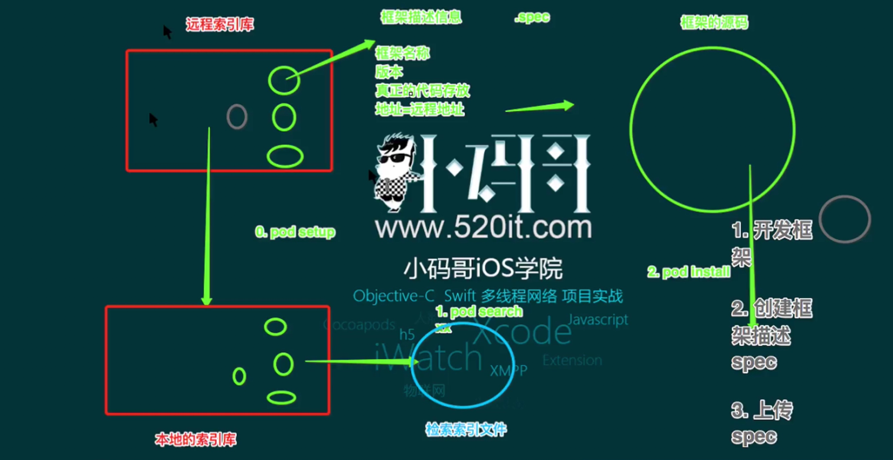
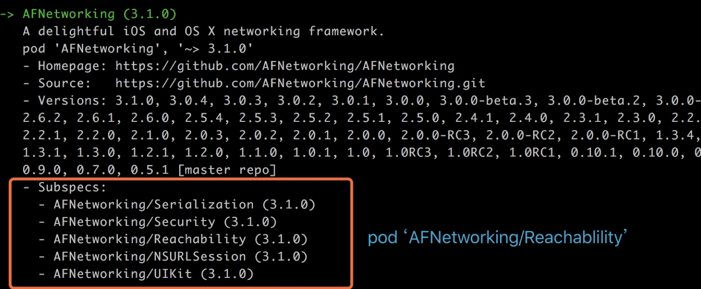
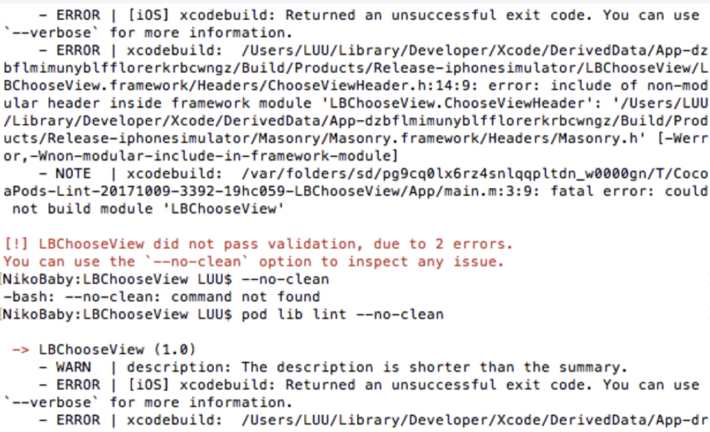

##原理

> 本地索引库    "/Users/vincent/.cocoapods/repos"
> 本地检索文件  "/Users/vincent/Library/Caches/CocoaPods/search_index.json"

`pod setup`   克隆远程索引库到本地
`pod search`  本地索引库里的检索索引文件
`pod install` 下载参考本地Podfile.lock的第三方库的版本
`pod update`  下载本地Podfile里如果没有指定版本号就更新最新, 这样协同合作的时候就会冲突





###私有库

> cocoapods字段命令解释 https://guides.cocoapods.org/

`pod spec create <项目名称>`  #创建spec文件

```ruby
Pod::Spec.new do |s|
  s.name             = "PodTestLibrary"    #名称
  s.version          = "0.1.0"             #版本号
  s.summary          = "Just Testing."     #简短介绍，下面是详细介绍
  s.description      = <<-DESC
                       Testing Private Podspec.
 
                       * Markdown format.
                       * Don't worry about the indent, we strip it!
                       DESC
  s.homepage         = "https://coding.net/u/wtlucky/p/podTestLibrary"                           #主页,这里要填写可以访问到的地址，不然验证不通过
  # s.screenshots     = "www.example.com/screenshots_1", "www.example.com/screenshots_2"           #截图
  s.license          = 'MIT'              #开源协议
  s.author           = { "wtlucky" => "wtlucky@foxmail.com" }                   #作者信息
  s.source           = { :git => "https://coding.net/wtlucky/podTestLibrary.git", :tag => "0.1.0" }      #项目地址，这里不支持ssh的地址，验证不通过，只支持HTTP和HTTPS，最好使用HTTPS
  # s.social_media_url = 'https://twitter.com/<twitter_username>'                       #多媒体介绍地址
 
  s.platform     = :ios, '7.0'            #支持的平台及版本
  s.requires_arc = true                   #是否使用ARC，如果指定具体文件，则具体的问题使用ARC
 
  s.source_files = 'Pod/Classes/**/*'     #代码源文件地址，**/*表示Classes目录及其子目录下所有文件，如果有多个目录下则用逗号分开，如果需要在项目中分组显示，这里也要做相应的设置
  s.resource_bundles = {
    'PodTestLibrary' => ['Pod/Assets/*.png']
  }                                       #资源文件地址
 
  s.public_header_files = 'Pod/Classes/**/*.h'   #公开头文件地址
  s.frameworks = 'UIKit'                  #所需的framework，多个用逗号隔开
  s.dependency 'AFNetworking', '~> 2.3'   #依赖关系，该项目所依赖的其他库，如果有多个需要填写多个s.dependency
end</twitter_username>

```

####添加framework 和 微信的依赖, 依赖pod

==更新spec尤其是关于目录文件的, 得同时更新tag==

```
// .h
spec.source_files = 'YFTestKit/Classes/*.{h,m}', 'YFTestKit/Classes/ThirdParty/*.{h}' 
// .a 
spec.vendored_libraries  = 'YFTestKit/Classes/ThirdParty/*.{a}'
spec.frameworks = 'SystemConfiguration','CoreGraphics','CoreTelephony','Security','CoreLocation','JavaScriptCore'
spec.libraries  = 'iconv','sqlite3','stdc++','z'
// 依赖pod
spec.dependency   'AFNetworking', '~> 3.1.0'

```


####本地私有库


```
缺点
1. 协同开发麻烦
2. 路径更换麻烦
3. 版本维护麻烦(有时只需要旧的功能)

```

```
目录结构

├── LocalPrivateLib  // 宿主工程
│   ├── LocalPrivateLib
│   │   ├── AppDelegate.h
│   │   ├── AppDelegate.m
│   │   ├── ...
│   ├── Podfile
|
└── repo 
    └── XXCategory // 分类私有库
        ├── Classes 
        │   ├── UIButton+Helper.h
        │   └── UIButton+Helper.m
        └── XXCategory.podspec
```


```
$ cd ../XXCategory
$ git init
$ pod spec create XXCategory // 私有库同名
 # 编辑 XXCategory.podspec , 
    s.source = { :git => "", :tag => "#{s.version}" } // git => "这里为空"
$ cd ../LocalPrivateLib
$ pod init
 # 编辑 Podfile
    pod 'XXCategory', :path => '../repo/XXCategory' // 目的是找到 xx.podspec
    pod 'PodTestLibrary', :podspec => '~/code/Cocoapods/podTest/PodTestLibrary/PodTestLibrary.podspec'  #指定podspec文件 二选一
```


####远程私有库


```
1. 创建远程索引库, 本地添加私有索引库

github, 码云, 码市建私有库
$ pod repo add  TextPrivateLib  https/ssh地址


2. 创建远程私有库

$ pod lib create privateBase #模板
$ git remote add origin https/ssh  #关联远程
$ git push origin master
$ git tag "0.1.0" 
    > 扩展
    $git log --pretty=oneline --abbrev-commit
    $git tag 1.0.2 <commit号>
$ git push --tags
$ pod lib lint  #本地验证当前目录的spec, 不验证远程(source tag)
$ pod spec lint #远程验证
    #pod lib lint  --allow-warnings 忽略警告, 通过验证 

3. 关联到本地私有索引库

# pod search
$ pod repo push  本地私有索引库名  xx.podspec  #自动push到远程索引库
    #--allow-warnings 忽略警告, 通过验证 

4. 使用私有库

$ pod repo  #拿到索引库URL

# Podfile 文件
    source 'https://github.com/CocoaPods/Specs.git' #对应repo URL(官方路径)
    source 'https://gitee.com/yf_personal/TestPrivateLibSpec.git' #(私有索引库路径)

    target 'xxx' do
        use_frameworks!
        pod 'privateBase' #直接pod
    end
$ pod install


5. 每次更新步骤
 > 修改私有库文件
 > 更新spec文件
 > 打tag push
 > 重新关联本地私有索引库 pod repo push xx xx.podspec
 > 项目 pod update --no-repo-update
```

####SubSpecs



```
为什么要用

1. AFN我只需依赖 Reachability, 这时依赖整个AFN就不太合适也不方便
2. 不用subSpecs, 所有的文件都在同一个文件夹里, 不好查看
3. 方便分离库本身对外界的依赖

    ├── Base  // 主库
    │   ├── Network
    │   │   ├── AFN (依赖 n.dependency 'AFNetworking', '~> 2.3')
    │   │── Category
    │   │── Tool
```


```
1. 本地目录

└── Classes
    ├── Category
    │   ├── UIButton+Helper.h
    │   └── UIButton+Helper.m
    ├── Network
    │   ├── Network.h
    │   └── Network.m
    ├── Tool
    │   ├── Tool.h
    │   └── Tool.m
    └── PrivateBase.h
        
2. 修改 .podspec 文件

    Pod::Spec.new do |s|  # 主库
        
        s.source_files = 'PrivateBase/Classes/PrivateBase.h'
    
        s.subspec 'Network' do |n|
            n.source_files = 'PrivateBase/Classes/Network/**/*'
            n.dependency 'AFNetworking'
        end
    
        s.subspec 'Category' do |c|
            c.source_files = 'PrivateBase/Classes/Category/**/*'
        end
    
        s.subspec 'Tool' do |t|
            t.source_files = 'PrivateBase/Classes/Tool/**/*'
        end
    end

#字段
    s.source_files :
         一般放头文件或没字段, 只有在导入主库的时候才有的文件 pod 'PrivateBase'
    s.subspec 'Network' do |n| :
         'Network' search显示的子库名  n : 别名

3. 每次更新步骤
 > 修改私有库文件
 > 更新spec文件
 > 打tag push
 > 重新关联本地私有索引库 pod repo push xx xx.podspec
 > 项目 pod update --no-repo-update

4. Podfile

    #pod 'privateBase/Network'
    #pod 'privateBase/Tool'
    等价
    pod 'privateBase', :subspecs => ['Network', 'Tool']
```


####问题
> pod search 搜索不到


```ruby
$ rm ~/Library/Caches/CocoaPods/search_index.json
或$pod setup
$ pod search xxx
```

> pod spec lint 错误




解决方法:
1. buldsetting 中设置 Allow Non-modular Includes In Framework Modules 为 YES
2. 将#import "**.h" 第三方库写在 .m文件中，而不是放在.h文件中即可
3. 在podspec文件里面加上   s.user_target_xcconfig = { 'CLANG_ALLOW_NON_MODULAR_INCLUDES_IN_FRAMEWORK_MODULES' => 'YES' }


> push 失败

[upstream push pull默认行为](https://segmentfault.com/a/1190000002783245)

```ruby
2.0后push.default = simple, 没有指定upstream, 或本地和远程的分支不同名
# 指定
    $git branch --set-upstream-to=origin/<branch> develop 
# 或者$git push --set-upstream origin develop

error: failed to push some refs to 'git@github.com:******/Demo.git'
hint: Updates were rejected because the tip of your current branch is behind
hint: its remote counterpart. Merge the remote changes (e.g. 'git pull')
hint: before pushing again.
hint: See the 'Note about fast-forwards' in 'git push --help' for details.

    $git push -u origin master -f
```


